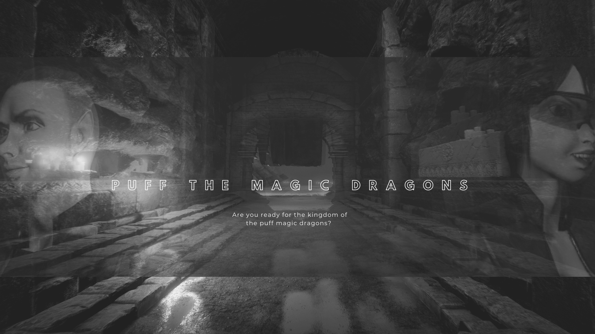
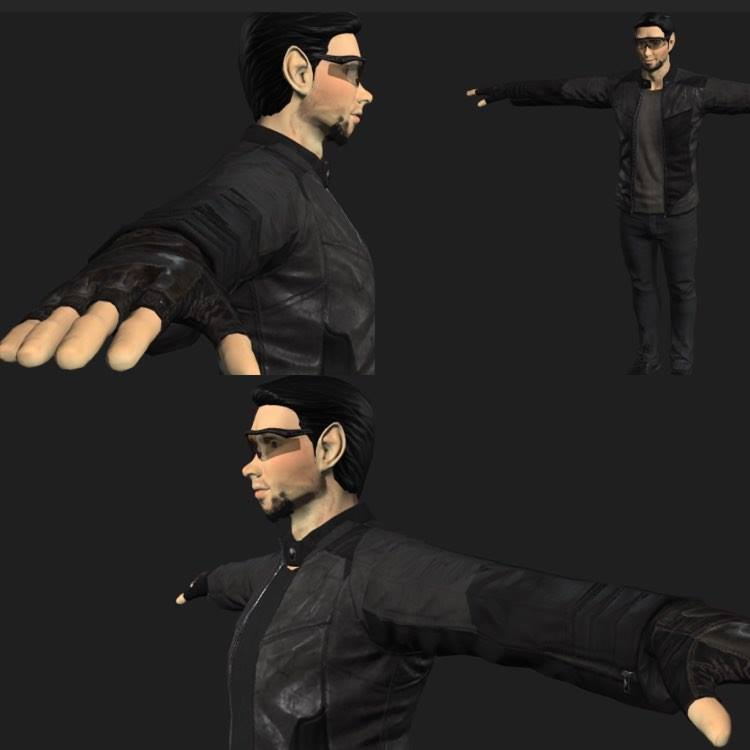
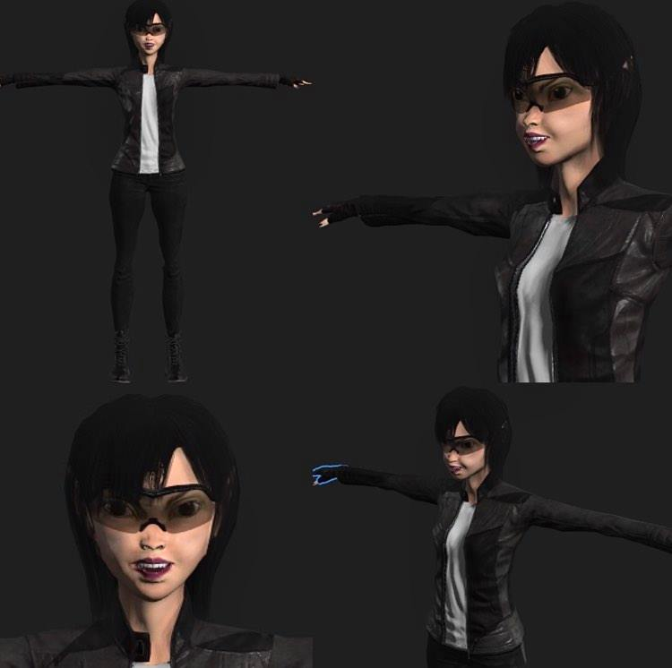
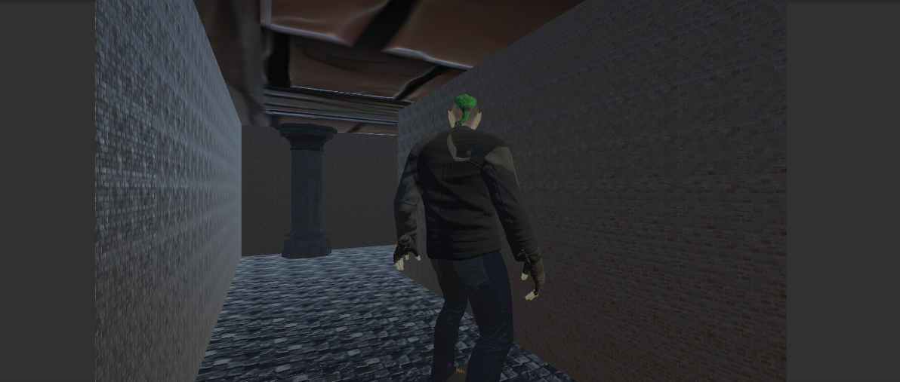
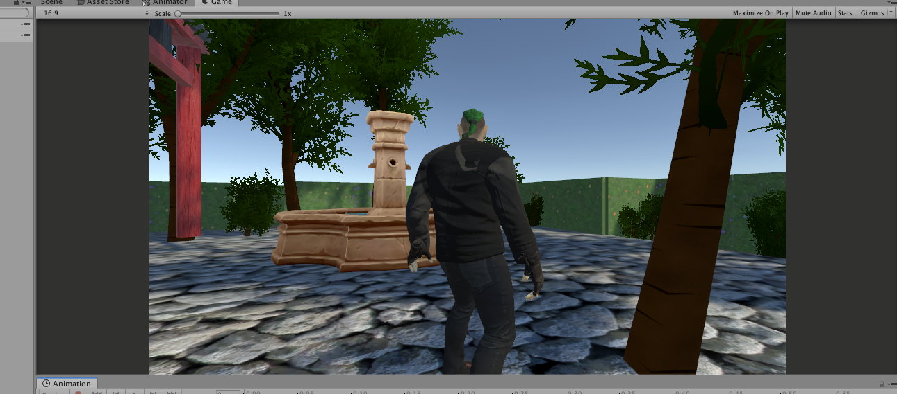
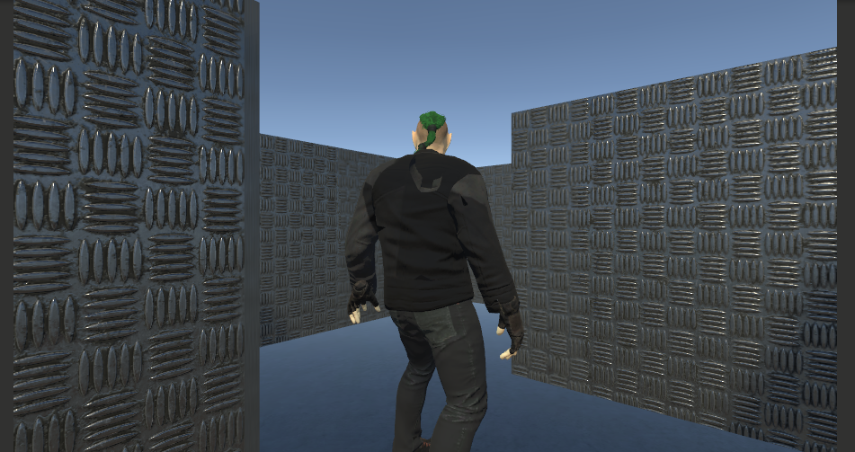
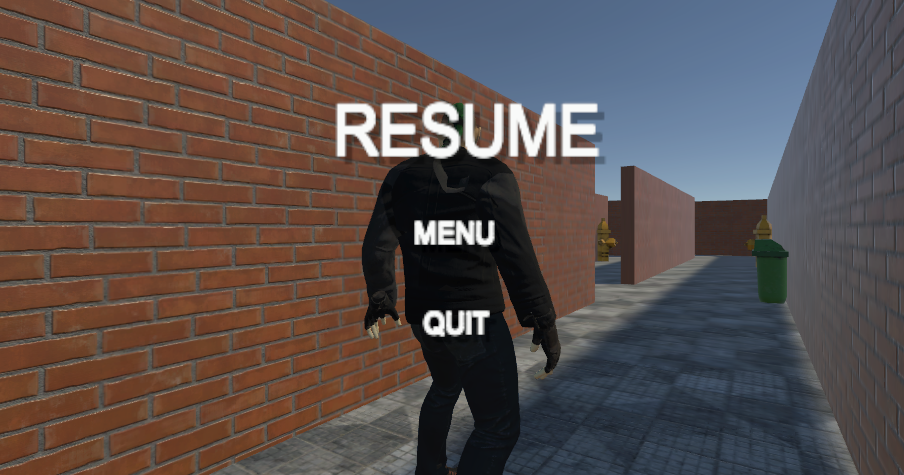
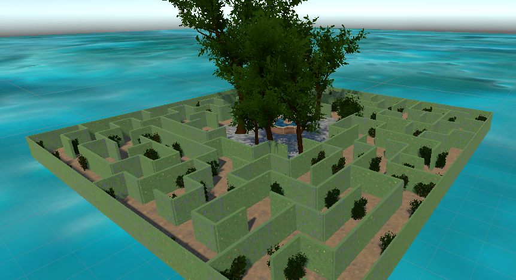

# PuffTheMagicDragons first adventure together.

We will build one 3D game using Unity, which will evolve with time. New ( brilliant ) ideas will be added here step by step. :soon:

We are at the very beginning of this journey. 

Our mission is to deliver the best possible product to our clients by the end of the semester.

Stay with use, only glory to come. :sparkler:

The mazes are generated usign a script, so get rid of the hard work.

Characters are made using Adobe Fuse.

Are you ready to step in the world of cyberpunk ?

Our game is available here : https://simmer.io/@turdasan/puffthemagicdragons-1-2?fbclid=IwAR0hvJ3wdtm3MqS4l1bun5PMvOHqxIM9zvGVwDZzufocr6A6GCL20kiC3wo

## Build with
* Unity 
* Visual Studio
* basic C# knowledges

#### Authors
- Mariş Oana
- Stoianović Iasmina 
- Turdăşan Bogdan

## Characters

## Levels

## Pause Game

## Maze preview (maze from level 2)

